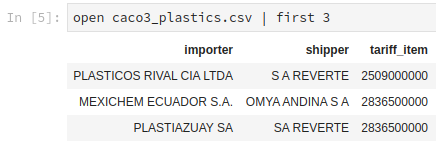
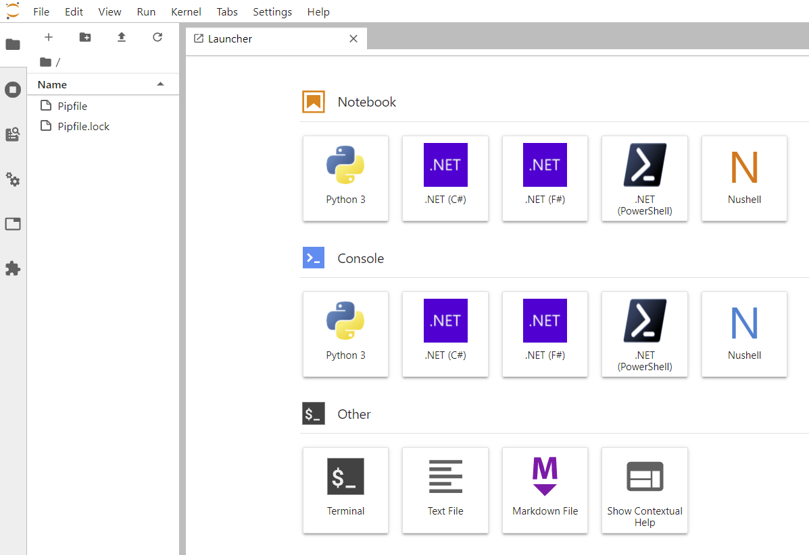

# Jupyter Notebook support for Nushell



This is a very(!) experimental kernel for Jupyter for running Nushell. It currently requires 0.11.1 or later.

To install and run the kernel:

```
> cd nu_jupyter
nu_jupyter> jupyter kernelspec install ../nu_jupyter --user
nu_jupyter> jupyter lab
```

Limitations:

* State is not kept between runs. This is something that will change in future versions.

## How to create the python egg
This step is only needed if you've made changes to the nushell kernelspec.

### Creating the python egg
To create the egg file do the following:
```
> cd nu_jupyter
nu_jupyter> python.exe setup.py bdist_egg
```
This creates an egg file in the `dist` folder that pipenv can utilize.

## Installing using pipenv
From within your pipenv environment folder, mine is called `me/jup`.
```
jup> pipenv install -e git+https://github.com/nushell/nu_jupyter.git#egg=dist
```
This should add the nu_jupyter kernelspec and insert entries in your pipfile and pipfile.lock file.
## Running with pipenv
From within your pipenv env folder, mine is called `/me/jup`.
```
# To activate your pipenv environment, run
jup> pipenv shell

# To add the new jupyter kernel
jup> jupyter kernelspec install ../nu_jupyter --user

# To launch jupyter lab, run
jup> jupyter lab
```
After launching you should have jupyter lab looking similar to this.

The last thing is to ensure that NuShell is somewhere in your path. Jupyter requires access to it in order to run the commands in the notebook.